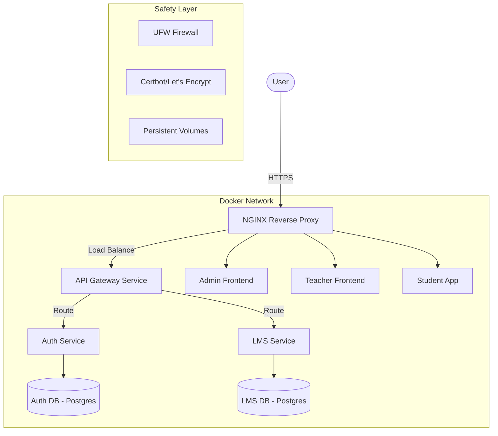

# Deployment Plan: Safe & Load-Balanced LMS on Hostinger VPS

This plan outlines how to deploy the LMS microservices architecture onto a Hostinger VPS using Docker, NGINX, and a secure infrastructure setup.

## Architecture Overview

We will use a **Multi-Container Docker Architecture** managed by **Docker Compose**. Traffic will be routed through **NGINX** acting as a High-Performance Reverse Proxy and Load Balancer.

## User Review Required

> [!IMPORTANT]
> **VPS Resources**: Running 6 services + 2 databases requires at least **4GB RAM** (Hostinger KVM 2 or higher). If you have 2GB, we must enable **Swap Space** and limit memory per container.
> **Domains**: You need a domain (e.g., `lms.com`) and subdomains (e.g., `admin.lms.com`, `api.lms.com`) pointed to your VPS IP.

## Proposed Changes

### 1. Containerization (New Files)

We will create optimized multi-stage Dockerfiles for each service to keep image sizes small.

#### [NEW] [Dockerfile.backend](file:///apps/auth-service/Dockerfile) (Example for Auth/LMS)
- Node.js 20 Alpine base.
- Multi-stage build (build -> production).
- Security: Runs as non-root user.

#### [NEW] [Dockerfile.frontend](file:///apps/admin-front/Dockerfile) (Example for Next.js)
- Production build using `next build`.
- Optimized for size.

### 2. Orchestration

#### [NEW] [docker-compose.yml](file:///docker-compose.yml)
This file will define:
- **Services**: All 6 apps.
- **Networks**: Internal `lms-network` (isolated from public).
- **Databases**: Two PostgreSQL instances on separate volumes for "load balancing" I/O.
- **Scaling**: We can scale the backend services (e.g., `docker-compose up --scale lms-service=2`).

### 3. Load Balancing (NGINX)

#### [NEW] [nginx.conf](file:///nginx/nginx.conf)
- Configures NGINX to load balance between multiple instances of services.
- Handles SSL termination.
- Gzip compression for performance.

### 4. Safety & Security

- **Environment Variables**: Managed via `.env` files (never committed to Git).
- **Firewall**: Only ports 80, 443, and 22 (SSH) will be open.
- **Database**: Databases are NOT exposed to the internet; only accessible within the Docker network.
- **SSL**: Automatic certificate renewal with Certbot.

## Verification Plan

### Automated Tests
- `docker-compose config` to verify syntax.
- NGINX syntax check: `nginx -t`.

### Manual Verification
1.  **Deployment**: Run `docker-compose up -d`.
2.  **Connectivity**: Check if all subdomains resolve correctly.
3.  **Persistence**: Stop containers, restart, and verify database data remains.
4.  **Load Balancing**: Check NGINX logs to see traffic being distributed between scaled service instances.

## Database "Load Balancing" Note
On a single VPS, we achieve "Database Load Balancing" by:
1.  **Process Separation**: Running two separate PostgreSQL instances for Auth and LMS. This prevents one service's heavy queries from locking the other's database.
2.  **Resource Limits**: Assigning CPU/Memory limits to each DB container to ensure stability.
3.  **Read Replicas (Optional)**: If you need even more performance, we can set up a Primary/Replica pair for the LMS database, though this is usually recommended only for multi-node setups.
